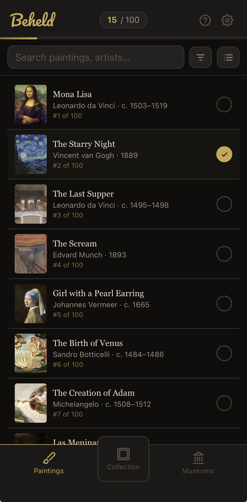
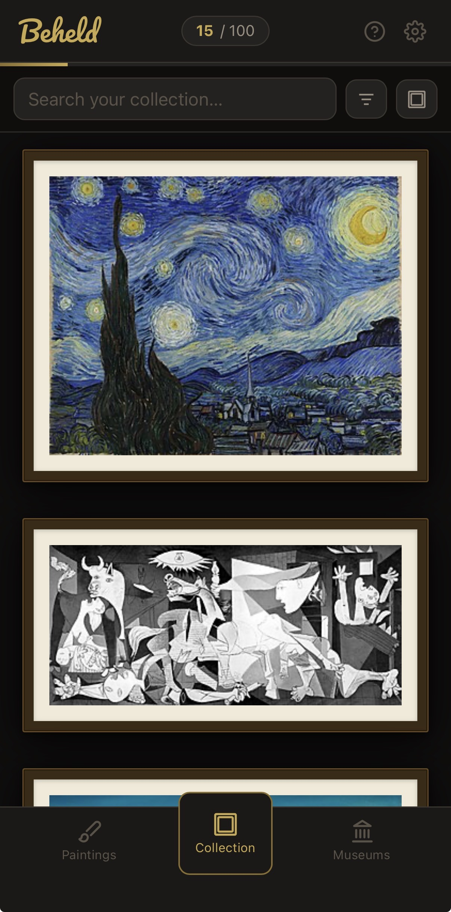
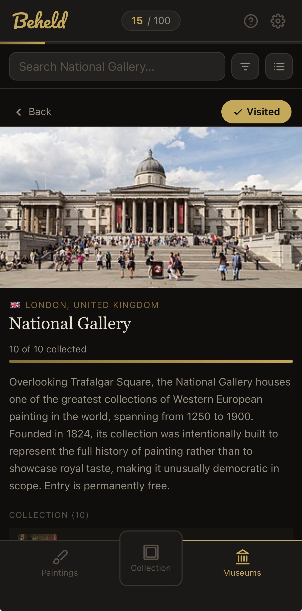

# Beheld

A progressive web app for tracking which of the world's most famous paintings you've seen in person.

Browse 100 ranked works plus ~320 additional pieces by museum, artist, or movement; check off what you've seen; attach your own photos and notes; and see your progress broken down by museum and region. Works fully offline once loaded, and installs to a phone home screen like a native app.

**Live app:** https://c-fawkes.github.io/beheld/

---

## Screenshots

| Paintings | Collection | Museums |
|---|---|---|
|  |  |  |
| The ranked list, searchable and filterable, with a tap target to mark each work as seen | Collected works displayed as framed pieces in a gallery wall | Museum pages with location, description, visited status, and per-museum progress |

---

## Features

- **421 paintings** across 100 ranked works and museum-specific extras, filterable by continent → country → city → museum
- **Collection tracking** — mark paintings as seen, add photos and notes, record the date collected, and favorite pieces
- **Museum pages** — written descriptions and photos for each institution, with visited tracking and per-museum progress; sortable alphabetically or by city or country
- **Gallery presentation** — collected works are rendered as framed pieces rather than a plain grid
- **Stats** — progress aggregated by museum and region, with expandable per-museum breakdowns
- **Scope control** — show only the ranked top 100, or expand to 10 or 30 works per museum
- **Fully offline** — all assets and images cached locally; the app works with no network connection after first load
- **Installable** — meets PWA install criteria on iOS and Android

## Tech

Vanilla JavaScript, HTML, and CSS. No framework, no build step, no dependencies.

| Area | Implementation |
|---|---|
| State | Single global state object, persisted to `localStorage` |
| Photo storage | IndexedDB (`beheld-db`) |
| Offline | Service worker, cache-first for assets and images |
| Styling | CSS custom properties, dark museum-inspired theme |
| Hosting | GitHub Pages |

### Architecture

Three files carry the app: `data.js` defines the painting, artist, museum, and movement datasets; `app.js` holds all application logic and rendering; `styles.css` holds all styling.

Rendering is deliberately simple — a single `render()` function reads the active view from state and replaces the contents of the main container. There's no virtual DOM or diffing. For an app of this size the full re-render is fast enough to be imperceptible, and it removes an entire category of state-synchronization bugs.

A few decisions worth calling out:

**Photos moved from localStorage to IndexedDB.** Photos were originally stored as base64 strings in `localStorage` alongside the rest of the app state. Users with more than a handful of photos hit the browser's storage quota. Photos now live in IndexedDB and are loaded into memory on startup, while the main state object stays small and serializable.

**Image caching went from network-first to cache-first.** Painting images are hosted on Wikimedia Commons. Network-first meant every view triggered remote fetches, which made the app slow on poor connections and unusable offline. The service worker now pre-caches all painting, artist, and museum images in batches shortly after startup, so the app is fully usable offline after the first visit.

**Scoping is computed, not stored.** Rather than maintaining separate datasets per scope, a single function filters the full painting list based on the active scope setting. Adding a new scope tier is a one-line change.

## Running locally

No build step. Serve the directory and open it:

```bash
python3 -m http.server 8080
# open http://localhost:8080
```

The service worker only activates over HTTPS or `localhost`, so offline caching won't work if you serve from another host or IP — the rest of the app still runs.

## How this was built

This project was built using AI coding agents, primarily Claude Code, with me acting as architect and reviewer rather than writing the code line by line.

Most of the engineering effort went into the *process* rather than the code. Across 30+ development sessions I built up a specification (`CLAUDE.md`) that governs how the agent works in this repository:

- **Enforced workflows.** Adding paintings to the dataset is a multi-step task that was repeatedly done inconsistently, so it's now a defined command with a required sequence: read current state, research sources, add records, syntax-check, then report.
- **Commit controls.** The agent never commits or pushes without explicit instruction, after early sessions produced commits I hadn't reviewed.
- **Context management.** A checkpoint at ~85% context usage prompts committing work in progress, so long sessions don't lose state.
- **Documentation standards.** Every session appends to a changelog with a defined format, and any entry describing a feature that was later changed or removed gets annotated with the session that superseded it — so the docs stay accurate as the app evolves rather than drifting into fiction.

Each of these rules exists because something went wrong first. The specification is the accumulated result of debugging the workflow, not a plan written up front.

## Project structure

```
index.html        Markup and app shell
app.js            Application logic, state, rendering
data.js           Painting, artist, museum, and movement data
styles.css        All styling
sw.js             Service worker — caching and offline support
manifest.json     PWA manifest
CLAUDE.md         Agent specification and architecture notes
docs/             Session-by-session development log
scripts/          Data maintenance utilities
```
